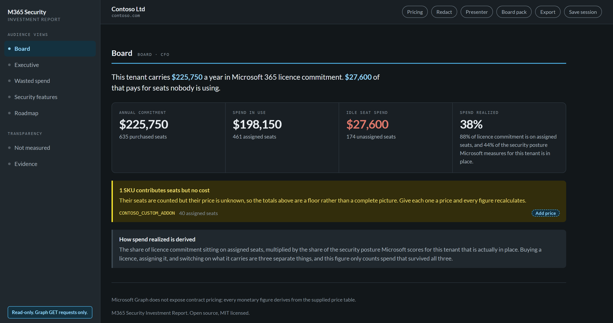
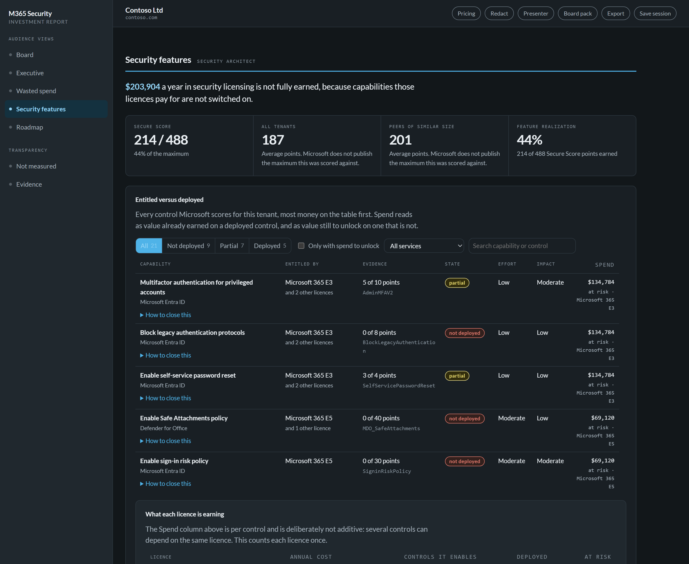
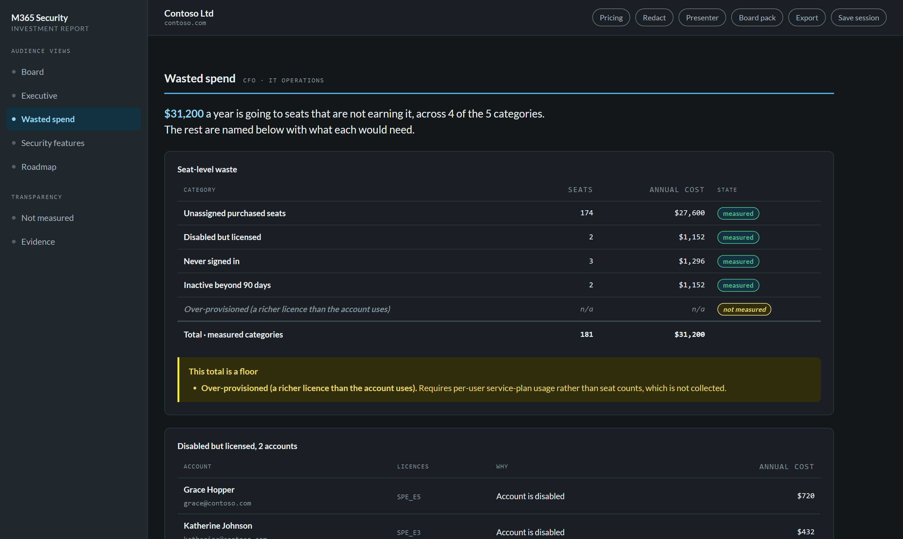
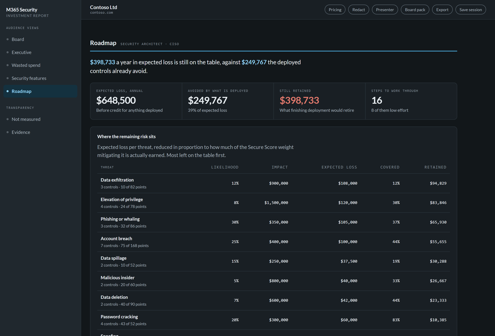

# M365 Security Investment Report

Find the security capability you already bought and never switched on.

This tool reads one Microsoft 365 tenant through Microsoft Graph, read only, and reports
how much of the security capability your licences pay for is actually deployed, what the
gap costs, and what to fix first.

It produces a board pack, an interactive report that opens offline, and JSON and CSV for
finance.

**<https://cloud-harbor-consulting-llc.github.io/M365-Security-Investment-Report/>**

Choose **Explore the sample tenant** to see all of it with no sign-in and nothing
installed.

> [!IMPORTANT]
> **The shipped prices are list prices, not yours.** The table prices 44 SKUs: 28 checked
> against Microsoft's published pricing in September 2026, including the increase effective
> 1 July 2026, 2 inferred from a related SKU, and 14 carried forward unchecked because
> Microsoft publishes no per-seat figure for them, mostly the standalone Defender
> components. Every entry says which it is. List prices are almost always higher than
> negotiated EA, MCA or CSP rates, so check or replace the table before any client
> engagement. The report states which basis produced its figures, every time.

---

## What it looks like

Every figure below comes from the synthetic sample tenant, which is the same one the
**Explore the sample tenant** button opens. No real tenant appears anywhere in this
repository.

### Board

What a CFO sees first: the commitment, what is idle, and how much of it is earned.



### Security features

The view the rest of this tool exists for. Every control Microsoft scores, what entitles
you to it, whether it is deployed, and the spend riding on it.



### Wasted spend

5 categories of seat-level waste. The one that could not be measured says so in the table
and again underneath, rather than reading as zero.



### Roadmap

What to fix first, ranked by value against effort, with the expected loss each gap still
carries.



Regenerate these from the sample tenant with `node scripts/make-screenshots.mjs`, which
builds the one-file report through the same code path the Export button uses.

---

## Read-only, and provably so

This tool never writes to your tenant. It has no remediation capability, no write scopes,
and no code path that could acquire one.

Three tests enforce that, and they fail the build:

1. **One chokepoint.** Every Graph call goes through a single function that hardcodes
   `GET` and exposes no method parameter. No caller can choose a verb.
2. **No write scope is ever requested.** 5 read-only scopes, and the guards reject any
   scope that is not `.Read` or `.Read.All`.
3. **Both tiers are checked**, by
   [`tests/ReadOnly.Guard.Tests.ps1`](tests/ReadOnly.Guard.Tests.ps1) and
   [`app/src/graph/readonly.test.ts`](app/src/graph/readonly.test.ts). They must also
   request the identical scope set.

Read those tests before you consent the app. They are short, and they carry the whole
trust argument.

There is also no backend. The app is static files. Collection goes browser to Microsoft
Graph and back, and nothing is uploaded anywhere. See [PRIVACY.md](docs/PRIVACY.md).

---

## Three ways in

| | What it needs |
|---|---|
| **Explore the sample tenant** | Nothing. A synthetic tenant with the awkward cases built in. |
| **Connect to a tenant** | An administrator consents once. Nothing to register, nothing to install. |
| **Load a snapshot** | Run the PowerShell collector yourself and drop the file in. For organisations that prefer to run code they can read. |

Same dashboard, same figures, same exports either way.

For consent, registering your own app, or avoiding registration entirely, see
[APP-REGISTRATION.md](docs/APP-REGISTRATION.md).

---

## What you get

**Board pack.** 6 pages for print or PDF, in the order a sceptical CFO asks the questions,
ending with what was measured, what you supplied, and what is assumed.

**One interactive HTML file.** The whole report, offline, reaching no external origin, and
still showing the board figures with JavaScript disabled. This is the file to leave with a
customer.

**JSON and CSV.** 7 sections plus a README naming which figures are measured and which are
assumed, because the file is the copy that gets forwarded.

**Session files.** Tenant data plus your negotiated prices, reopenable later.

---

## Quick start (PowerShell collector)

```powershell
Import-Module ./src/CloudHarbor.M365SecurityInvestment/CloudHarbor.M365SecurityInvestment.psd1

Connect-CHSITenant -TenantId contoso.onmicrosoft.com
Test-CHSIPrerequisite          # optional: confirms scopes and config before you collect
Get-CHSISnapshot -Path snapshot.json
Disconnect-CHSITenant
```

Then drop `snapshot.json` into the app. Or produce the static report locally:

```powershell
New-CHSIReport -OutputPath ./out
```

### With negotiated pricing

Microsoft Graph does not expose contract pricing, so every dollar figure comes from a price
table you control. The shipped table holds public list prices, which overstate what you
actually pay. A SKU the table cannot price is reported as unpriced rather than as $0, and
you can price it inline in the app or supply a table:

```powershell
New-CHSIReport -CustomPricing ./contoso-ea-rates.json -ConfigPath ./contoso.json -OutputPath ./out
```

The report states which basis produced its numbers, every time. In the app you can edit
prices live and every dependent figure moves.

### Unattended, and offline

```powershell
Connect-CHSITenant -TenantId contoso.onmicrosoft.com -ClientId $appId -CertificateThumbprint $thumbprint

New-CHSIReport -SaveSnapshot ./contoso-snapshot.json -OutputPath ./out   # collect and report
New-CHSIReport -FromSnapshot ./contoso-snapshot.json -OutputPath ./out   # re-analyse, no credentials
```

Collection and analysis are separate, so a snapshot taken on site can be re-priced later
without going back to the tenant. Snapshots are a convenience, not state. Nothing is read
back automatically, and no run depends on a previous one.

---

## Requirements

| | |
|---|---|
| PowerShell | 7.4 or later |
| Module | `Microsoft.Graph.Authentication` 2.15.0+ |
| Tenant | Any Microsoft 365 commercial tenant |
| Role to run | Global Reader, plus Security Reader for the Secure Score sections |
| Role to consent | Cloud Application Administrator or equivalent, once |

5 delegated read-only scopes: `Organization.Read.All`, `Directory.Read.All`,
`User.Read.All`, and optionally `AuditLog.Read.All` and `SecurityEvents.Read.All`. The
optional 2 are entitlement-gated. Without them the affected sections report as *not
measured* and say why. Full table and reasoning:
[APP-REGISTRATION.md](docs/APP-REGISTRATION.md#what-is-being-approved).

---

## Documentation

| | |
|---|---|
| [METHODOLOGY.md](docs/METHODOLOGY.md) | How every figure is derived, and what it does not claim |
| [APP-REGISTRATION.md](docs/APP-REGISTRATION.md) | Consent, your own app registration, or neither |
| [PRIVACY.md](docs/PRIVACY.md) | What is read, where it goes, what your exports contain |
| [SECURITY.md](SECURITY.md) | Reporting a vulnerability, and the guarantees CI enforces |
| [CONTRIBUTING.md](CONTRIBUTING.md) | Code and data contributions, and the 2 rules that will surprise you |
| [THIRD-PARTY-NOTICES.md](THIRD-PARTY-NOTICES.md) | What this project redistributes, and under what terms |
| [CONTROL-ENTITLEMENTS.md](docs/CONTROL-ENTITLEMENTS.md) | The entitlement research, cited and confidence-marked |
| [ARCHITECTURE.md](docs/ARCHITECTURE.md) | How it is put together, and why each guarantee holds |
| [CHANGELOG.md](CHANGELOG.md) | What changed in each release, and what each one still cannot do |

One rule governs every figure in the report: a CFO-facing report must never show `$0` where
the truth is "we could not look." Every degraded signal renders as an explicit *not
measured, and here is why*.

---

## Accessibility

Checked in CI. Contrast is computed from the design tokens themselves, for both themes.
Overlays are modal dialogs with focus trapped and restored. Tables carry captions and
column scopes.

The report gets projected in meeting rooms, where a bright room does to everyone what low
contrast does to some people always.

---

## Configuration

Copy [`config/chsi-config.example.json`](config/chsi-config.example.json) and pass it with
`-ConfigPath`. It sets the pricing basis and currency, the inactivity threshold (default 90
days), the exemption list for service accounts and room resources, the free-SKU seat
thresholds, and the risk-model inputs. Anything omitted keeps its default.

---

## Status

**v1.0.** Everything on this page works today. What each release changed, and what it
still cannot do, is in [CHANGELOG.md](CHANGELOG.md), which carries a known-limitations
section for exactly that reason.

How the pieces fit together: [`docs/ARCHITECTURE.md`](docs/ARCHITECTURE.md).

---

## Development

```bash
cd app && npm install
npm run dev          # dev server, with the sample tenant
npm test             # engine parity, exports, accessibility
npm run build        # type-check and production build
```

```powershell
Invoke-Pester ./tests
foreach ($root in './src', './tests', './scripts') {
    Invoke-ScriptAnalyzer -Path $root -Recurse -Severity Warning, Error
}
```

The engine exists twice. PowerShell collects, TypeScript computes, and parity tests assert
the two agree to the cent. That is what made the port safe, and it means a change to how a
figure is derived is usually 2 changes.

The whole suite runs offline, with no tenant and no credentials.

Read [CONTRIBUTING.md](CONTRIBUTING.md) before opening a PR.

---

## Roadmap beyond v1.0

- **Snapshot delta between runs.** The quarterly QBR story: "spend realized 61% to 74%."
  The highest-value future feature, and the reason v1.0 stays stateless.
- **Risk scaled to tenant size.** Impact is currently a flat assumption, so expected loss
  does not vary with headcount.
- **Per-gap remediation navigation.** Exact portal click-paths instead of Learn links.
- **"Newly entitled" flags.** Gaps created by Microsoft packaging changes, so a control
  that silently appeared in your SKU does not sit unconfigured for a year.
- **Direct policy evidence.** Reading Conditional Access and Defender policy objects, at
  the cost of additional scopes. v1.0 relies on Secure Score to keep the consent dialog
  short.

## Deliberately out of scope

- **Compliance-framework mapping (NIST, CIS, ISO).** A saturated lane. ScubaGear, monkey365
  and M365-Assess already do it well.
- **Copilot and AI-readiness assessment.** Different tool, different audience.
- **Multi-tenant or MSP mode.** Single-tenant, consultant-run, by design.
- **Any write or remediation capability.** Read-only, always.

---

## License

MIT, see [LICENSE](LICENSE).

Everything this project redistributes, and under what terms, is listed in
[THIRD-PARTY-NOTICES.md](THIRD-PARTY-NOTICES.md). The short version: Preact and MSAL are
MIT, Lato is under the SIL Open Font License 1.1, and 568 of the 619 SKU catalogue
entries come from Microsoft's MIT-licensed documentation.

No logo, wordmark or trademark ships in this repository. The palette and typeface carry the
visual identity, so a fork inherits a complete, usable tool and no marks it has no right to
use. Reports credit whoever prepared them through the `preparedBy` setting, and omit the
line entirely when it is unset.

Originally built by [Cloud Harbor Consulting](https://cloudharborconsulting.cloud).
